# [../](../)

# 3.5 mm MOS MUF definitions files

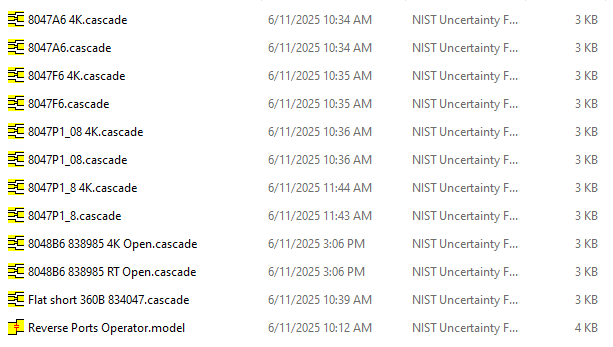

# SMA MOS MUF definition files

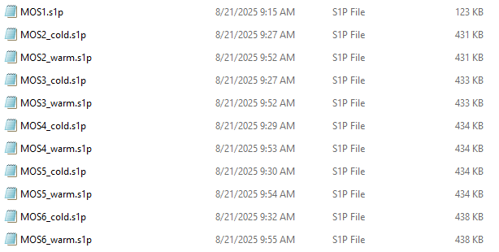

# MOS dimensional definitions

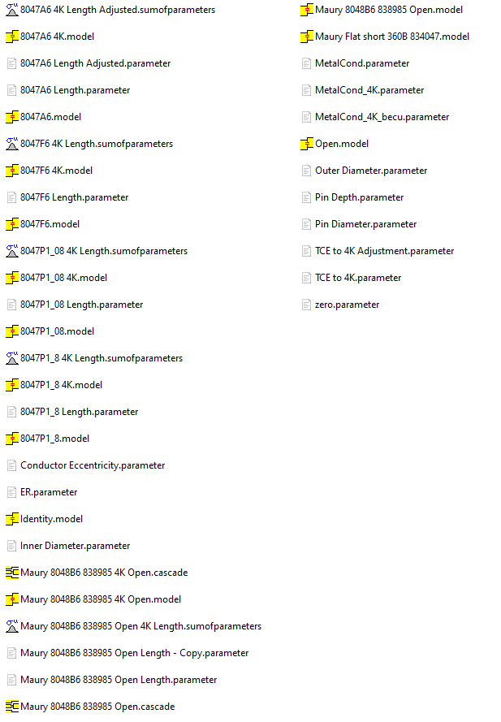

# MUF menu set for both tier 1 and tier 2 calibrations

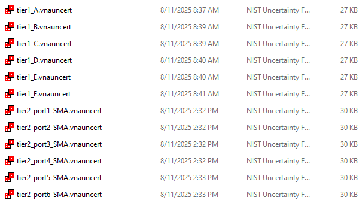

# SMA MOS definitions

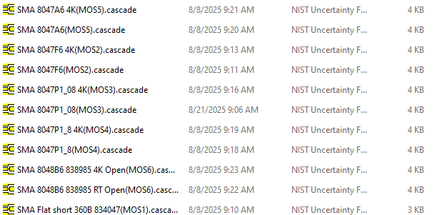

# MOS5 menus 

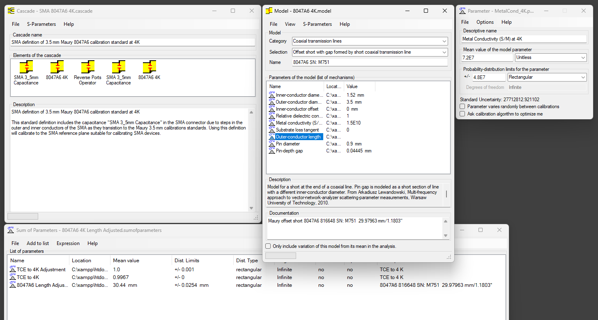

# Shunt capacitance definition

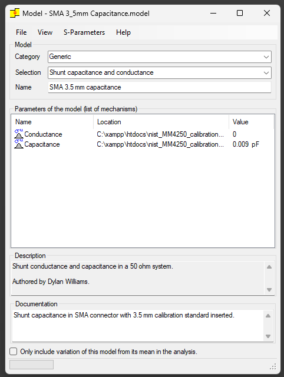

# Tier 1 menu, VNA tab

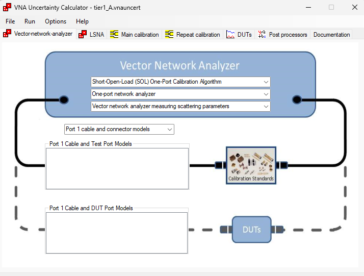

# Tier 1 menu, main cal tab

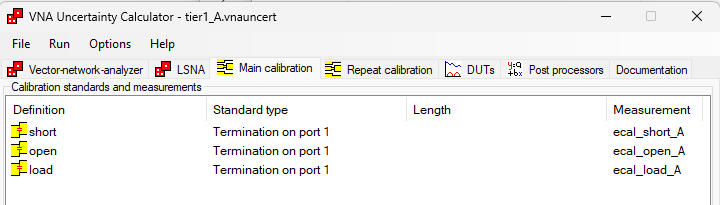

# Tier 1 menu, DUT tab

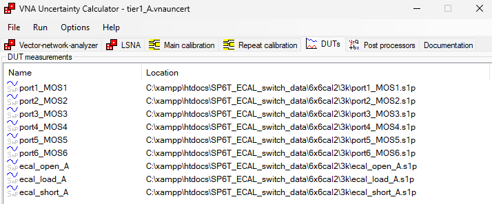

# Tier 2 menu, VNA tab

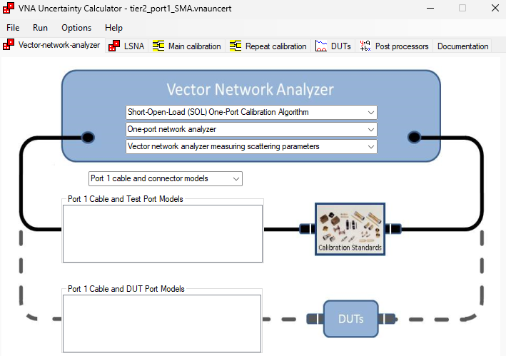

# Tier 2 menu, main cal tab

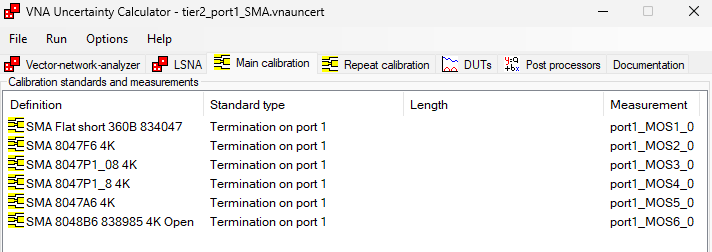

# Tier 2 menu, DUT tab

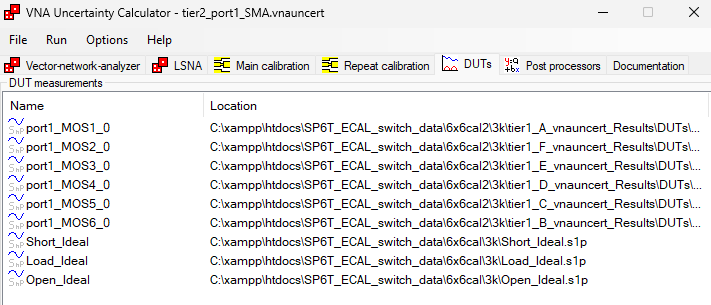

