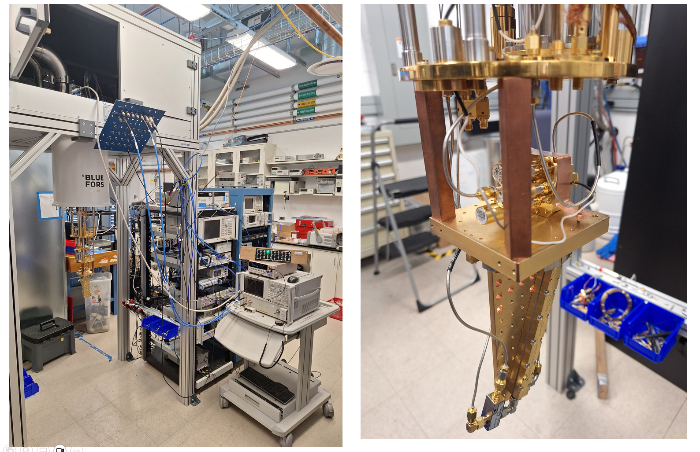

# [nist_MM4250_calibration_data_2025](https://github.com/lafefspietz/nist_MM4250_calibration_data_2025/)

This data set represents a set of measurements carried out on the Menlo Micro MM4250 single pole six throw MEMS-based switches with built in calibration standards on the printed circuit board.  This data set is the product of measurements carried out at [NIST](https://www.nist.gov/) [Boulder](https://www.boulder.doc.gov/) in the [Flux Quantum Electronics(FQE)](https://www.nist.gov/programs-projects/flux-quantum-electronics) project of the [Superconductive Electronics](https://www.nist.gov/ctl/rf-technology-division/superconductive-electronics-group) group in the [Radio Frequency Technology](https://www.nist.gov/ctl/rf-technology-division) division of the [Communications Technology Laboratory](https://www.nist.gov/ctl). Data were taken primarily by Lafe Spietz in a cryostat which was built in-house at NIST which has a base temperature of just under 3 [kelvin](https://www.bipm.org/en/si-base-units/kelvin) and a [dilution refrigerator](https://en.wikipedia.org/wiki/Dilution_refrigerator) with a base temperature of 25 mK.  Data were taken from early June through early August of 2025, in [building 1 of NIST, Boulder](https://www.openstreetmap.org/#map=18/39.995189/-105.261952).

# Data Narrative

On June 6, 2025, we recieved a MM4250 switch prototype, serial number #0031, from the team at Menlo when they came to visit Boulder.  We spent a couple of days trying to use a pair of switch controllers which turned out to have issues with low voltage or voltage not switching, and then we switched to the MEMSDuino controller we built at NIST, which took a day or so to adapt for the different drive line topology of this switch.  

Calibration standards are referred to as MOS1, MOS2, MOS3, MOS4, MOS5 and MOS6, and "MOS" stands for "Maury Offset Short", and they are all defined as in the table in the above graphic. 

On June 12, we put the 6 calibration standards on the switch and cooled it down for the first time in the 3 K cryostat in the "A" configuration. We then spent until June 20 cooling down the cryostat repeatedly while rotating to all of the 6 cyclic positions, labelled A, B, C, D, E, and F, of the calibration standards.  On June 20, we installed the switch in the XLD dilution refrigerator in wing 2 of building 1 at NIST.  We took some data at room temperature to understand the experiment, and then cooled the fridge to 4 kelvin to get data for comparison to base.  At 4 kelvin, we were not able to switch the switch into all the states anymore, something seemed to be broken. We believe that this was related to the charging effects which can be an issue in these switches if there is no DC path to ground. In this measurement we did not have a bias tee, and have concluded that this is very likely an essential element of any successful experiment using these switches.  

It took some time to get the switch out of the XLD fridge due to other experiments being in the fridge at the same time. The last week of June we got another two switches, serial numbers #0030 and #0033, which we have also been testing, but not with calibration standards.  We found that there was inconsistent behavior in the switches when they were used without a bias tee and some path to ground.  XLD data are not included in this data set as they were not usable for any purpose.

The first week of July we started to always use the switches with a bias tee, using a physical banana cable jumper to ground to always keep a DC path to ground connected while switching, as well as using our [MEMSDuino](github.com/lafefspietz/MEMSduino) controller set to always ground all the connections between switch operations.  We also started to always test the DC resistance with a digital multimeter between measurements, and to repeat all measurements to check for consistency(both DC and RF).

Based on analysis of the first 6x6 cal we decided to repeat the entire set of 6 cooldowns in the hopes of getting better uncertainty in the full calibration than on the first attempt. This took from about July 21 to July 28, after which we transfered the switch into the SD dilution refrigerator in wing 1 of Building 1 at NIST.  Over the days July 30 to July 31, we measured the switch with the standards in the "F" configuration at room temperature, about 3 K, about 1 K, about 100 mK, and about 25 mK.  These data are all in the folder [dilution_refrigerator_data/](dilution_refrigerator_data/).

Finally, we measured switch serial number #0030 in the 3 K system to get an estimate of insertion loss, return loss, and isolation.  This data set is in [single_switch_0030_data/](single_switch_0030_data/).

The details of the calibration and uncertainties will be presented in the paper to be published with this data set, which will reference this data set.

# [Jupyter Notebooks](https://jupyter.org/)

 - [scikitrf_tier1_cal.ipynb](scikitrf_tier1_cal.ipynb)
 - [scikitrf_tier2_cal.ipynb](scikitrf_tier2_cal.ipynb)
 - [dilution_refrigerator_data.ipynb](dilution_refrigerator_data.ipynb)
 - [MOS_definition_plots.ipynb](MOS_definition_plots.ipynb)
 - [single_switch_0030_data.ipynb](single_switch_0030_data.ipynb)
  
All Jupyter notebooks use the [scikit-RF](https://scikit-rf.org/) open source(BSD license) Python library for both plotting and calibration as well as for working with the [Touchstone file format](https://en.wikipedia.org/wiki/Touchstone_file). 

The above [Jupyter notebooks](https://jupyter.org/) first perform a calibration using the internal standards on the printed circuit board and apply those calibrations to the measured $S_{11}$ for each standard on each port over the 6 cooldowns, repeated for the first and second cooldown and at both room temperature and 3k.  This first notebook([scikitrf_tier1_cal.ipynb](scikitrf_tier1_cal.ipynb)) saves each calibrated measurement of each standard on each port as a Touchstone file(.s1p) in an appropriate sub-folder of [tier1_scikitrf_caldata/](tier1_scikitrf_caldata/).  The second notebook([scikitrf_tier2_cal.ipynb](scikitrf_tier2_cal.ipynb)) fetches the files saved by the first notebook and uses them to perform a tier 2 calibration with the standards files created by the MUF to represent calculated values of the $S_{11}$ of each standard, taken from the folder [MOS_MUF_model_construction/MOS_definitions_touchstone/](MOS_MUF_model_construction/MOS_definitions_touchstone/). Having constructed a tier 2 calibration with all 6 standards on all 6 ports, this second notebook then applies that calibration to a set of ideals where the $S_11$ is just -1, 1, or 0 for short, open and load, and then saves each ideal for each port warm and cold from each calibration in a set of folders inside the folder [tier2_scikitrf_caldata/](tier2_scikitrf_caldata/).  This is the data set which can then be used for further calibrations in the e-cal mode of operation that will apply to most users.

The notebook [dilution_refrigerator_data.ipynb](dilution_refrigerator_data.ipynb) uses the output of the previous notebook from the second calibration at 3k to perform the e-cal which allows us to measure in a dilution refrigerator with a cryogenic [HEMT](https://en.wikipedia.org/wiki/High-electron-mobility_transistor) amplifier and a cold directional coupler using a measurement system similar to that reported in [E. M. Wei, R. A. Chamberlin, N. Kilmer, J. Kast, J. A. Connors and D. Williams, "On-Wafer Vector-Network-Analyzer Measurements at mK Temperatures," in IEEE Journal of Microwaves, vol. 3, no. 2, pp. 587-598, April 2023](https://doi.org/10.1109/JMW.2022.3232076).  

The notebook [MOS_definition_plots.ipynb](MOS_definition_plots.ipynb) loads and plots the SMA MOS definitions created by MUF from [MUF models for SMA MOS models](MOS_MUF_model_construction/SMA%20Maury%20Offset%20Shorts/) to compare and see how much temperature matters. This notebook was created for debugging as we sorted out the value to use for the effective conductivity of the gold plated BeCu at cryogenic temperatures.  Finally, the data from the measurement of switch serial number $0030 are plotted and analyzed in [single_switch_0030_data.ipynb](single_switch_0030_data.ipynb).

# Raw Data Sets

 - [First 6x6cal data set, 3k (6x6cal1/3k/)](6x6cal1/3k/)
 - [First 6x6cal data set, 295k (6x6cal1/295k/)](6x6cal1/295k/)
 - [Second 6x6cal data set, 3k (6x6cal2/3k/)](6x6cal1/3k/)
 - [Second 6x6cal data set, 295k (6x6cal2/295k/)](6x6cal1/295k/)
 - [25 mK data from dil fridge(dilution_refrigerator_data/base/)](dilution_refrigerator_data/base/)
 - [100 mK data from dil fridge(dilution_refrigerator_data/100mk/)](dilution_refrigerator_data/100mk/)
 - [1 K data from dil fridge(dilution_refrigerator_data/1k/)](dilution_refrigerator_data/1k/)
 - [3 K data from dil fridge(dilution_refrigerator_data/3k/)](dilution_refrigerator_data/3k/)
 - [Room temperature data from dil fridge(dilution_refrigerator_data/roomtemp/)](dilution_refrigerator_data/roomtemp/)
 - [Data from serial number #0030 at 3k and room temperature(single_switch_0030_data/)](single_switch_0030_data/)

# [Scikit-RF](https://scikit-rf.org/) Cal File Sets

 - [tier1_scikitrf_caldata/tier1_3k1/](tier1_scikitrf_caldata/tier1_3k1/)
 - [tier1_scikitrf_caldata/tier1_3k2/](tier1_scikitrf_caldata/tier1_3k2/)
 - [tier1_scikitrf_caldata/tier1_295k1/](tier1_scikitrf_caldata/tier1_295k1/)
 - [tier1_scikitrf_caldata/tier1_295k2/](tier1_scikitrf_caldata/tier1_295k2/)
 - [tier2_scikitrf_caldata/tier2_3k1/](tier2_scikitrf_caldata/tier2_3k1/)
 - [tier2_scikitrf_caldata/tier2_3k2/](tier2_scikitrf_caldata/tier2_3k2/)
 - [tier2_scikitrf_caldata/tier2_295k1/](tier2_scikitrf_caldata/tier2_295k1/)
 - [tier2_scikitrf_caldata/tier2_295k2/](tier2_scikitrf_caldata/tier2_295k2/)

    
# MUF File Sets

 - [6x6cal MUF Menu set](6x6cal_MUF_menu_set/)
 - [MUF models for 3.5 mm MOS standards](MOS_MUF_model_construction/35mm%20Maury%20Offset%20Shorts/)
 - [MUF models for SMA MOS models](MOS_MUF_model_construction/SMA%20Maury%20Offset%20Shorts/)
 - [Dimensional definitions used by MOS models](MOS_MUF_model_construction/Dimensional%20Definitions/)
 - [Touchstone file outputs from MUF MOS models](MOS_MUF_model_construction/MOS_definitions_touchstone/)

# [MUF Screenshots](MUF_screenshots/)

 - [MUF_screenshots/3.5mm_MOS_definitions.png](MUF_screenshots/3.5mm_MOS_definitions.png)
 - [MUF_screenshots/MOS_definition_files.png](MUF_screenshots/MOS_definition_files.png)
 - [MUF_screenshots/MOS_dimensional_definitions.png](MUF_screenshots/MOS_dimensional_definitions.png)
 - [MUF_screenshots/MUF_menu_set.png](MUF_screenshots/MUF_menu_set.png)
 - [MUF_screenshots/SMA_MOS_definitions.png](MUF_screenshots/SMA_MOS_definitions.png)
 - [MUF_screenshots/SMA_standards_cascades.png](MUF_screenshots/SMA_standards_cascades.png)
 - [MUF_screenshots/offset_shortMOS5_SMA_construction.png](MUF_screenshots/offset_shortMOS5_SMA_construction.png)
 - [MUF_screenshots/shunt_capacitance_MOSdef.png](MUF_screenshots/shunt_capacitance_MOSdef.png)
 - [MUF_screenshots/tier1_menu_1.png](MUF_screenshots/tier1_menu_1.png)
 - [MUF_screenshots/tier1_menu_2.png](MUF_screenshots/tier1_menu_2.png)
 - [MUF_screenshots/tier1_menu_3.png](MUF_screenshots/tier1_menu_3.png)
 - [MUF_screenshots/tier2_menu_1.png](MUF_screenshots/tier2_menu_1.png)
 - [MUF_screenshots/tier2_menu_2.png](MUF_screenshots/tier2_menu_2.png)
 - [MUF_screenshots/tier2_menu_3.png](MUF_screenshots/tier2_menu_3.png)

# [Photographs](photographs/)

 - [photographs/3kcal1.png](photographs/3kcal1.png)
 - [photographs/3kcal2.png](photographs/3kcal2.png)
 - [photographs/6x6dataplan.png](photographs/6x6dataplan.png)
 - [photographs/VNA.png](photographs/VNA.png)
 - [photographs/cold_image_whole.png](photographs/cold_image_whole.png)
 - [photographs/cold_switch_closeup1.png](photographs/cold_switch_closeup1.png)
 - [photographs/cold_switch_closeup2.png](photographs/cold_switch_closeup2.png)
 - [photographs/cold_switch_test.png](photographs/cold_switch_test.png)
 - [photographs/coupler.png](photographs/coupler.png)
 - [photographs/dil_fridge_cold_parts.png](photographs/dil_fridge_cold_parts.png)
 - [photographs/dilfridge1.png](photographs/dilfridge1.png)
 - [photographs/dilfridge2.png](photographs/dilfridge2.png)
 - [photographs/dilfridge3.png](photographs/dilfridge3.png)
 - [photographs/dilfridge4.png](photographs/dilfridge4.png)
 - [photographs/full_test_system.png](photographs/full_test_system.png)
 - [photographs/hemt.png](photographs/hemt.png)
 - [photographs/shorts.png](photographs/shorts.png)
 - [photographs/switch-face-1.jpg](photographs/switch-face-1.jpg)
 - [photographs/thru.png](photographs/thru.png)
 - [photographs/vna_to_panel.png](photographs/vna_to_panel.png)
 - [photographs/warm_RF_closeup.png](photographs/warm_RF_closeup.png)
 - [photographs/whole-experiment.jpg](photographs/whole-experiment.jpg)
 - [photographs/whole_experiment_3k.png](photographs/whole_experiment_3k.png)
 - [photographs/whole_warm_system.png](photographs/whole_warm_system.png)
 

