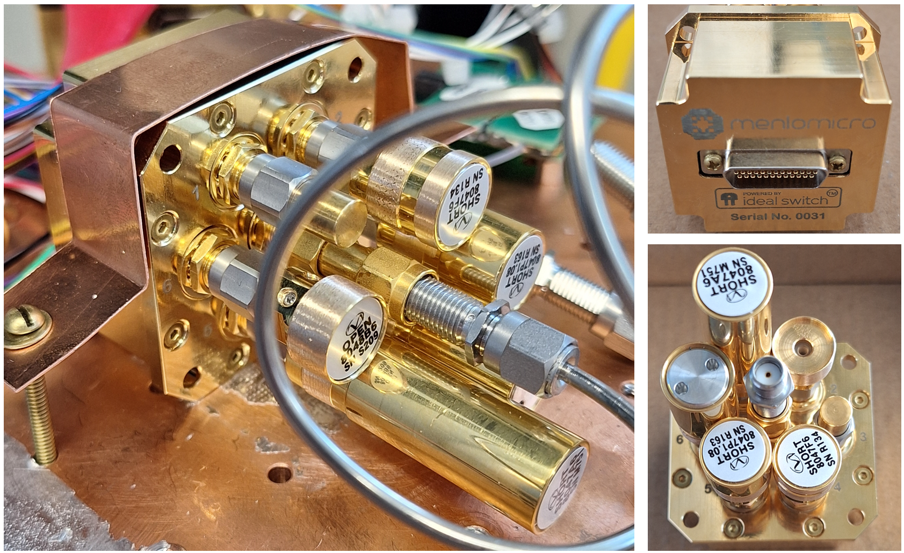

# [../](../)

# File set and standards for 6x6cal

# Closeup of switch in 6x6cal experiment

# Full measurement setup for 6x6cal

# Closeup of VNA used in 3 K tests

# Full dilution refrigerator experiment, warm

# Dilution refrigerator installation

# Closeup 1 in dilution refrigerator

# Closeup 2 in dilution refrigerator

# Directional coupler in dilution refrigerator

# Coupler, HEMT and whole system in dilution refrigerator

# Second composit dilution refrigerator picture

# Third composit dilution refrigerator picture

# Fourth composit dilution refrigerator picture

# Fifth composit dilution refrigerator picture

# Closeup of HEMT amplifier

# Closeup of switch face in dilution refrigerator

# VNA to SMA panel cables in/out

# Closeup of RF setup for #0030 switch

# Setup for 3 K tests of serial #0030 switch: warm

# Setup for 3 K tests of serial #0030 switch: cold

# Shorts used for scalar calibration measurement of #0030 switch

# Through used for scalar calibration measurement of #0030 switch

